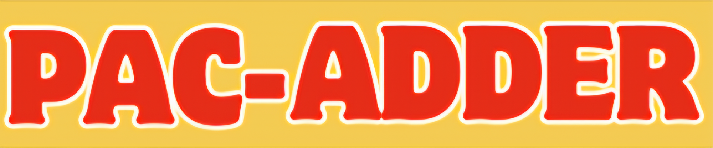

# PAC-ADDER

## [Play the Game!](https://marcocar97.github.io/pac-adder/)

# Description

En este juego nuestro elemento principal tiene que desplazarse por toda la pantalla para encontrar pequeñas bolas que hacen que su puntuación aumente y evitar colisionar con los fantasmas o tocar los bordes.

# Main Functionalities

- Movimientos del pacman en cualquier direccion, este movimiento debera ser constante y solo cambia de sentido al precionar la tecla asignada para eso.
- Aparecen bolas que el pacman necesita para poder aumentar su score, aparecen en puntos aleatorios de la pantalla y una vez el pacam ha tocado esta bola debe desaparecer y aparecer en otro punto.
- Deben existir fantasmas que son obstaculos y aparecer a medida que el score aumenta. si el pacman toca uno de estos fantasmas el juego termina.
- La velocidad del movimiento del pacman se ve afectada por el incremento del score.

# Backlog Functionalities

- Tiene 2 modos de juego, en el modo facil si el pacman toca un borde de la pantalla simplemente aparece en el lado opuesto, y los fantasmas aparecen con menos frecuencia. mientras que en el movimiento normal al momento de colicionar con cualquier borde el juego termina y los fantasmas aparecen con una mayor frecuencia.
- Agregar sonidos a los movimientos del pacman, y a las coliciones con otros objetos del juego.
- Se graba el score mas alto alcanzado.

# Technologies used

- Para este proyecto use HTML, CSS, Javascript, DOM Manipulation, Audios, Images.

# States

- Pantalla de Inicio : Aparece el logo del juego, intrucciones de como jugar y el boton de Start.
- Pantalla de juego: Aparece nuestra Game Box Node, el score, highScore, y los botones de Modo Normal y Modo Facil.
- Pantalla GameOver: Muestra que el juego a terminado y un boton de volver a intentarlo.

